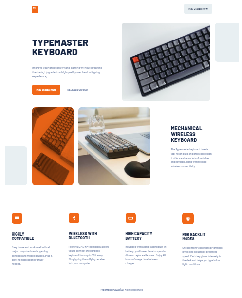
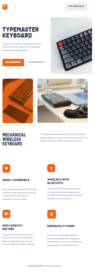

# Frontend Mentor - Typemaster pre-launch landing page solution

This is a solution to the [Typemaster pre-launch landing page challenge on Frontend Mentor](). Frontend Mentor challenges help you improve your coding skills by building realistic projects.

## Table of contents

- [Frontend Mentor - Typemaster pre-launch landing page solution](#frontend-mentor---typemaster-pre-launch-landing-page-solution)
  - [Table of contents](#table-of-contents)
  - [Overview](#overview)
    - [The challenge](#the-challenge)
    - [Screenshot](#screenshot)
    - [Links](#links)
  - [My process](#my-process)
    - [Built with](#built-with)
    - [What I learned](#what-i-learned)
    - [Continued development](#continued-development)
    - [Useful resources](#useful-resources)
  - [Author](#author)

## Overview

### The challenge

My challenge was to build out this Typemaster pre-launch landing page and get it looking as close to the design as possible.
Users are able to:

- View the optimal layout depending on their device's screen size
- See hover states for interactive elements

### Screenshot

This is screenshot of desktop version of the site: ,
and this is of tablet version: ,
and here is mobile version screenshot: 


### Links

- Solution URL: [https://github.com/Aleqsa123/typemaster]
- Live Site URL: [https://aleqsa123.github.io/typemaster/]

## My process

### Built with

- Semantic HTML5 markup
- CSS custom properties
- Flexbox
- CSS Grid
- Mobile-first workflow


### What I learned

I enhanced my knowledge in backgrounding. Making separate div for background was helpful, these were helpful for side shapes too. I mastered sizing and position of backgrounds. Filling image color was what I learnd
Mastered making link-buttons with only link tags and padding.

```css
.phone-keyboard {
    width: inherit;
    height: inherit;
    border-radius: 0rem 1rem 1rem 0rem;
    opacity: 0.75;
    mix-blend-mode: multiply;
}

### Continued development

It is time using javascript in projects.


### Useful resources

(https://developer.mozilla.org/en-US/) and (https://www.w3schools.com/) - These are amazing sites which helped me in backgrounding, also in flex and grid layouts.

## Author

- Frontendmentor - [Aleqsa123] (https://www.frontendmentor.io/profile/Aleqsa123)
- Github - [Aleqsa123](https://github.com/Aleqsa123)
- Linkedin - [Aleksi Merebashvili](https://www.linkedin.com/in/aleksi-merebashvili-36627426/)
- Facebook - [Aleksi Merebashvili](https://www.facebook.com/aleksi.merebashvili)
